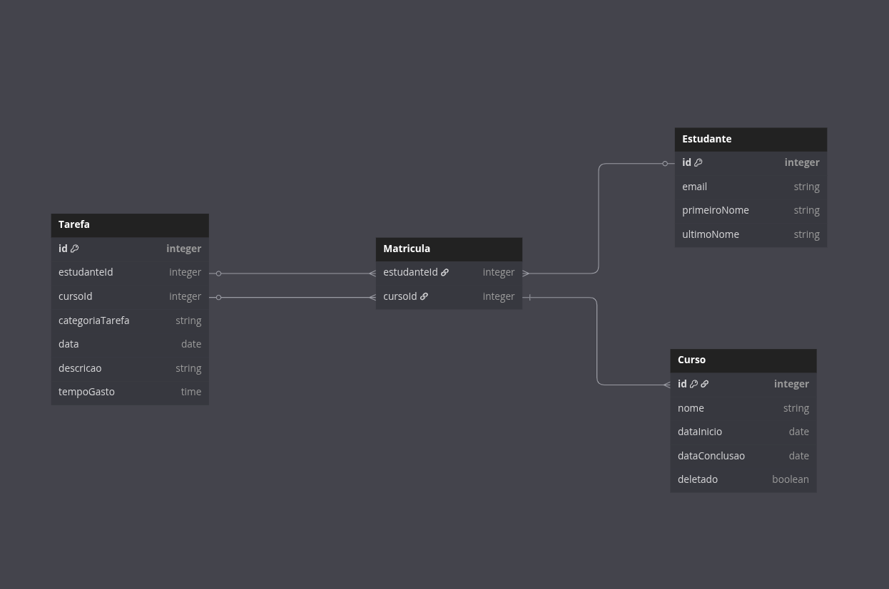

# learning-management-system


## Prerequisites

- Docker
- Docker compose

## Run
```
docker compose up -d
```

### Front end
http://localhost:4200

### Swagger
http://localhost:8080/swagger-ui/index.html

### H2 Database console
http://localhost:8080/h2-console

JDBC URL: jdbc:h2:file:./db/lms-db

User Name: adm


### Schema

